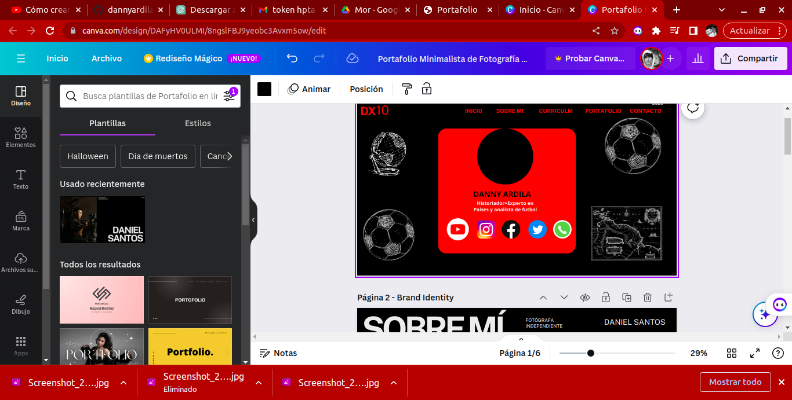
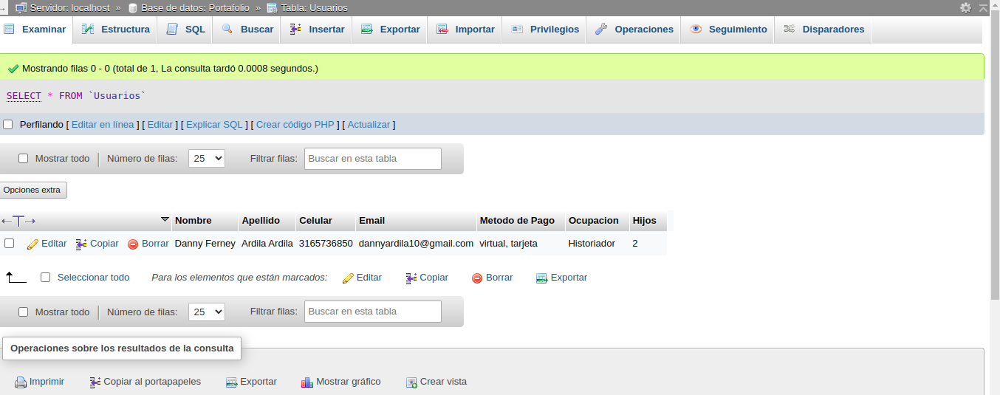
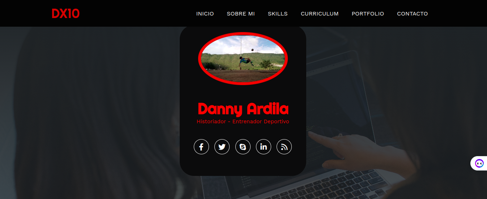

## Proyecto Portafolio Proyecto de vida 

1. Creacion de Interfaz con canvas 

2. Creacion de un logo 

3. Creacion de una base de datos

 
4. Primero pasos de la interfaz en html

5. Creacion del formulario